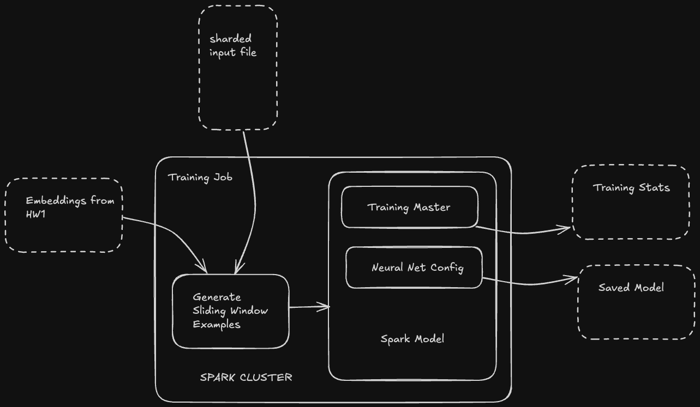

# Distributed LLM Training

Author - Gautham Satyanarayana <br />
Email - gsaty@uic.edu <br />
UIN - 659368048

## Introduction
As part of UIC-CS441 Engineering Distributed Objects for Cloud Computing, 
this project demonstrates how to train an LLM. 
For the second Homework, we build a spark job to tokenise, generate sliding window examples over an input text corpus 
and finally train a distributed LLM and monitor training metrics. 
<br /><br />
<b>Video Link</b>: 

## Environment
- MacOSX ARM64
- IntelliJ IDEA 2024.2.1
- Spark 3.5.2
- Scala v2.13.12
- SBT v1.10.2

## Training Parameters, Frameworks and Dataset
- Parameters
  - Window Size - 300
  - Slide Length - 100
  - Total number of sliding windows - 2678
  - Layers - LSTM, RNN Layers
  - Vocabulary - ~29,000 words <br /><br />
- Frameworks:
  - Tokenization - Jtokkit
  - Training - Dl4j-spark
  - Testing - munit
  - Config - TypeSafe Config
  - Logging - Sl4j <br /><br />
- Dataset:
  - Ulysses Text from Project Gutenberg


## Data Flow and Logic


## EMR Flow
Explained in the YouTube video linked above

## Test Suite
Tests are found in `/src/test/scala/Suite.scala` or just run from root

```angular2html
sbt test
```

## Results
Results such as training stats and the actual trained model can be found in `/results`

## Usage
1. Clone this repository, cd into the root and run 
```angular2html
sbt update
```
```angular2html
sbt clean compile assembly
```
This should install all the dependencies and create the jar file named `hw2.jar` in the `/target/scala-2.12` directory

2. Make sure Spark is running, and submit the jar as a spark job
```
 spark-submit \
    --class Main \
    --driver-memory 12g \
    --master "local[*]" \
    target/scala-2.12/hw2.jar \
    src/main/resources/ulyss12-sharded.txt \
    src/main/resources/embeddings.txt \
    <output path for saving training stats>< \
    <output path for saving the model>

```